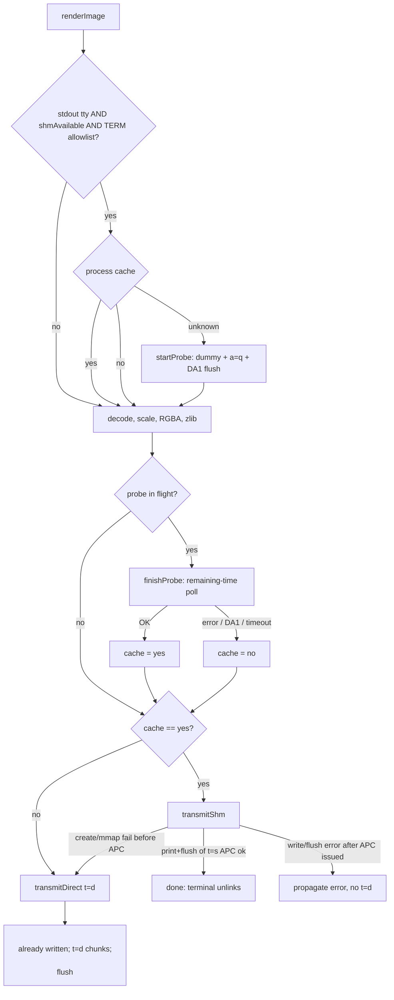

# POSIX Shared-Memory Transmission for Kitty Graphics

| Field | Value |
| --- | --- |
| **Author** | TBD |
| **Date** | 2026-08-30 |
| **Status** | Draft |
| **Product** | blackcat 0.7.3 (Zig 0.16.0) |
| **Scope** | `src/image.zig` (+ tests) and a small `src/main.zig` wiring change (`TERM`, test seed). No new CLI flags. No temp-file (`t=t`/`t=f`) medium. |

---

## Overview

`blackcat` already renders named image files through the Kitty graphics protocol, but it always uses in-band direct transmission (`t=d`: zlib-compress RGBA, base64, 4096-byte APC chunks on stdout). That path is correct over SSH and inside multiplexers, and it is the only portable fallback. Locally it is expensive: a typical terminal-sized RGBA frame is ~1–8 MiB uncompressed; after zlib and base64 it is hundreds of kilobytes to several megabytes of escape codes on the PTY.

This design adds POSIX shared-memory transmission (`t=s`) when it can actually help, and keeps the existing direct path otherwise. Detection is a one-shot Kitty query (`a=q` dummy 1×1 RGB + DA1) with a **100 ms remaining-time deadline**, started **before** decode so the wait overlaps work, and **skipped** when `TERM` is not a Kitty-protocol emulator. Result is cached for the process. Local create/mmap failures fall back to `t=d`. Write/flush errors after a shm APC has been issued **do not** fall back to `t=d` (that would emit two images). The client unlinks shm objects it created unless `print` **and** `flush` of the APC succeeded (the terminal unlinks after a successful read).

---

## Background & Motivation

### Current pipeline (`src/image.zig` `renderImage`)

1. Decode with zigimg (`Image.fromFile`).
2. `ioctl(1, TIOCGWINSZ)` for pixel size; scale to fit with a small cell margin.
3. Convert to RGBA (`f=32`).
4. Bilinear resize if needed (`resizeImage`).
5. Always zlib-compress (`o=z`) via `std.compress.flate.Compress` (the `if (true)` block).
6. Base64-encode (`std.base64.standard.Encoder`).
7. Write Kitty APC chunks of 4096 bytes to the stdout `std.Io.Writer`:
   - first: `\x1B_Gf=32,o=z,s={w},v={h},a=T,m=1;{chunk}\x1B\\`
   - middle: `\x1B_Gm=1;{chunk}\x1B\\`
   - last: empty `\x1B_Gm=0;\x1B\\`
8. No `t=` key → default `t=d` (direct / in-band).

Layout bytes: `renderImage` writes `"\n     "` **before** the empty-payload check. If compressed/base64 length is 0 it `return`s without the trailing `"\n\n"` and without the inner `flush`.

`src/main.zig` `catFile` only attempts this for **named files** (not stdin `-`), and only when `-k` / `--no-image` is unset (`options.kitty` is inverted: `true` means *disable*). On `renderImage` error it prints to stderr and returns; it does not dump the file as binary.

Release targets (`build.zig`): linux musl x86_64/aarch64, macos x86_64/aarch64, freebsd x86_64/aarch64. Linux musl **does not** `linkLibC`. macOS and FreeBSD always use libc.

There are **no** image-protocol unit tests today. `zig build test` runs the exe module tests plus `tests/cat_compat.zig`. Zig 0.16 **does** compile tests in files imported by the test root (`main.zig` already `@import("image.zig")`). PR 1 still adds `test { _ = image; }` in `main.zig` so discovery is obvious.

### Pain

- Direct transmission base64-inflates the payload by 4/3 and wraps it in APC framing. Large images stall the PTY.
- Shared memory is the medium Kitty, Ghostty, and WezTerm prefer for local clients (`kitten icat` probe order: memory → file → stream).
- shm is **local to the machine that called `shm_open`**. Over SSH the local terminal cannot see remote objects. `SSH_CONNECTION` is not a reliable signal (kitty ssh kitten, etc.).
- A client that only “tries shm and hopes” will silently fail to display over SSH.
- A 100 ms query on every tty (Terminal.app, xterm, Linux console) would be a regression versus 0.7.3 for the common `blackcat img.png` case. The cache does not help a one-image process.

### Protocol facts (Kitty graphics)

Spec: https://sw.kovidgoyal.net/kitty/graphics-protocol/

| `t` | Medium | APC payload |
| --- | --- | --- |
| `d` (default) | Direct | base64 of pixel (or zlib) bytes, chunked with `m=` |
| `f` | Regular file | base64 of path |
| `t` | Temp file | base64 of path; terminal may unlink if path is in a known tmp dir and contains `tty-graphics-protocol` |
| `s` | POSIX shm object | **base64 of the shm name**, not the pixels. Terminal `shm_open`s, reads, then **unlinks and closes** on POSIX. |

Example:

```
<ESC>_Gs=10,v=2,t=s,o=z;<encoded /some-shared-memory-name><ESC>\
```

`S`/`O` give size/offset. **Always send `S=<len>`** for shm. Ghostty, given `o=z` without `S`, reads the whole `fstat` size (page padding) and zlib inflate fails.

`a=T` transmit+display. `a=q` query (try load, reply OK/error, do not store). `i=` is a non-zero id echoed in the reply:

```
<ESC>_Gi=<id>;OK<ESC>\
<ESC>_Gi=<id>;<error message><ESC>\
```

Query pattern used by `kitten icat` (`kittens/icat/detect.go`):

1. Create a 1×1 RGB dummy (3 bytes `{1,2,3}`).
2. Send `a=q` with unique `i=` for `t=d`, `t=t`, and `t=s`.
3. Send DA1 (`CSI c` = `\x1B[c`).
4. Wait for APC replies until DA1 arrives or timeout (default **10s**).
5. Prefer memory, then file, then stream.
6. tmux passthrough: skip memory/file detection (no replies). **We do not skip tmux.** If passthrough delivers `OK`, shm is correct and better than icat’s skip.

`kitten icat` `transmit_shm` (`kittens/icat/transmit.go`): `shm.CreateTemp("icat-*", size)`, copy pixels, `Close()` (terminal unlinks), APC with `t=s` and `S=<data_size>`, payload = shm **name** bytes (then base64 by the graphics encoder).

---

## Goals & Non-Goals

### Goals

- Prefer POSIX shm (`t=s`) for local Kitty-protocol terminals when stdout is a tty, `TERM` looks like a Kitty-protocol emulator, and a real query says shm works.
- Fall back to the existing zlib + base64 + chunked `t=d` path whenever shm cannot be used — without a 100 ms tax on xterm/Terminal.app.
- Keep GNU-cat I/O: never consume stdin looking for graphics replies (`blackcat f - g` must still work).
- Clean up shm objects the client created, except after a successful APC **print+flush** (terminal owns unlink then).
- No new flags. `-k` / `--no-image` remains the off switch. Default is automatic.
- Smallest change: stay in `src/image.zig` plus minimal `main.zig` wiring. Extract `transmitDirect` / `transmitShm` / probe helpers. No strategy framework, no new modules.
- Tests that do not need a live Kitty and **do not** `tcsetattr` the developer’s tty.

### Non-Goals

- Temp-file (`t=t`) or regular-file (`t=f`) transmission. icat uses these as a middle preference; the user asked for shm + tty fallback only. Follow-up if a terminal implements file but not shm **and** query-only-shm would miss it — today those terminals still get `t=d`.
- `memfd_create` as a transmit medium. Kitty’s `t=s` is a POSIX shm **name**, not an anonymous fd. memfd cannot be sent as `t=s`.
- tmux/screen passthrough wrapping (`DCS tmux; ...`). Current blackcat already sends raw APC. We do **not** detect-and-skip tmux: if `allow-passthrough` delivers an `OK`, use shm.
- `--transfer-mode`, `--detect-support`, or debug stderr.
- Animation, Unicode placeholders, PNG-in-protocol (`f=100`), or placement control.
- Changing image detection, scaling, or the `-k` flag polarity.
- Linking libc on Linux musl release builds.
- Metrics, tracing, or log levels. Quiet like GNU cat.

---

## Proposed Design

### High-level control flow



Pixel pipeline stays one path through zlib. Probe I/O is started **before** decode when the cache is unknown. Dummy probe object is never the display payload.

### When shm is eligible

Attempt a probe (or use cache=`yes`) only if **all** of:

1. `std.Io.File.stdout().isTty(io)` is true. Writing `t=s` into a redirected file cannot help and can leak objects. `isTty` error → not a tty.
2. The OS backend can create POSIX shm (`shmAvailable()`: Linux, macOS, FreeBSD). Compile-time `else` → stream, no probe.
3. `termMayHaveKittyGraphics(term)` is true (see TERM allowlist).
4. Process cache is `yes`, or `unknown` (then probe). Cache `no` → stream, no probe.

`term` is passed into `renderImage` from `main.zig` via `init.environ_map.get("TERM") orelse ""` (`Environ.Map.get`, Zig 0.16). Unit tests pass `"dumb"` or `"xterm-kitty"` and never call `File.stdout().isTty` on the test process.

### TERM allowlist

**Skip the probe** (immediate `t=d`, 0 ms added) unless `TERM` identifies a Kitty-protocol emulator. Match is case-sensitive, as `TERM` is:

| Needle | Matches |
| --- | --- |
| `xterm-kitty` | Kitty default |
| `xterm-ghostty` | Ghostty |
| `ghostty` | Ghostty alternate |
| `wezterm` | `wezterm`, `wezterm-direct`, … |
| `kitty` | rare `TERM=kitty` |

Match function: equal, **or** `startsWith(needle)` and the next byte is `'-'`. That allows `wezterm-direct` without matching a hypothetical `wezterminal`.

**Not matched** (immediate `t=d`): `xterm`, `xterm-256color`, `linux`, `dumb`, `vt100`, `screen`, `screen-256color`, `tmux`, `tmux-256color`, `rxvt`, empty, unset. WezTerm/iTerm2/Konsole that leave `TERM=xterm-256color` skip shm and display via `t=d` with **no** 100 ms wait. Users who want shm can set `TERM=wezterm` / `xterm-kitty`.

SSH from Kitty: `TERM` is still `xterm-kitty`, so we **do** probe. The query fails or times out (remote shm is invisible) → `t=d`. That 100 ms (often overlapped by decode) is the remaining cost and is required; local-fail-only is still rejected.

tmux: `TERM` is usually `tmux-256color` / `screen-256color` → skip probe, `t=d`. If the user exported `TERM=xterm-kitty` inside tmux, we probe. If `allow-passthrough` delivers `OK`, use shm. **Do not special-case tmux.**

### Probe-once (not per-image, not local-fail-only)

**Choice: one `a=q` dummy + DA1 per process, 100 ms remaining-time deadline, cache in a `var`, overlapped with decode, TERM-gated.**

| Alternative | Why not |
| --- | --- |
| Local-fail-only (try `shm_open`, send `t=s` if it works) | Broken over SSH: remote `shm_open` succeeds, local kitty cannot see the object, image never appears. `SSH_CONNECTION` is insufficient (kitty ssh kitten). |
| Try `a=T,t=s` with `i=` and resend `t=d` on error | Stalls **every** image waiting for a reply. Also races cleanup. |
| icat’s 10 s timeout | blackcat is a cat clone. |
| Probe on every tty, after zlib | 100 ms regression on Terminal.app/xterm; no overlap with decode. |

False-negative on a slow host: first image uses `t=d` (still works); cache `no` poisons the rest of `blackcat *.png`. Accept; do not retry. False-positive is worse (missing image).

Cache:

```zig
const ShmSupport = enum { unknown, yes, no };
var shm_support: ShmSupport = .unknown;

fn resetShmSupportForTest() void {
    shm_support = .unknown;
}
```

Single-threaded CLI; no atomics. Tests **must** call `resetShmSupportForTest()` in setup. Subsequent images in `blackcat a.png b.png` reuse the result. `-k` never reaches `renderImage`. TERM skip does **not** write the cache (re-check is cheap).

Do **not** also probe `t=d`. Today we already emit `t=d` on non-Kitty terminals (garbage APC, existing behavior).

### Probe I/O algorithm

This is the implementation contract for `startProbe` / `finishProbe`.

#### `startProbe` is transactional

`renderImage` uses `probe = startProbe(io, writer) catch null`. `defer finishProbe` runs **only** if a `ProbeSession` is returned. Therefore `startProbe` must be all-or-nothing: either it returns a session whose `finish` will restore tty/handlers, or it restores everything itself, sets `shm_support = .no`, and returns an error. Restore must **not** depend on a live `ProbeSession`.

**Order** (dummy create before any process-visible tty mutation, because `/dev/shm` missing is the common failure):

1. Open `/dev/tty` `.read_only`, `tcgetattr` (save). Open is not a termios mutation. On failure: `shm_support = .no`, return error. Nothing to restore.
2. `createShm(io, &shm_dummy_rgb)` — fills the 3-byte dummy. On failure: close the tty fd, `shm_support = .no`, return error. Tty never mutated.
3. `unmap` + `closeFd` (object stays; keep the POSIX name).
4. **First mutation:** `tcsetattr` (ICANON/ECHO off, VMIN=VTIME=0). From here every error path uses `errdefer`.
5. Install SIGINT/SIGTERM handlers; set handler globals (`probe_tty_fd`, saved termios, dummy name).
6. Write query APC + DA1 to the stdout Writer, `flush`. Record `deadline`. Return `ProbeSession`.

Zig `errdefer` is LIFO: last declared runs first. After step 4, declare the chain so **runtime** order on error is:

1. Restore previous `Sigaction`s (needs `probe_old_int` / `probe_old_term`; no-op if install had not succeeded).
2. `tcsetattr(..., saved)` (ignore errors).
3. Unlink the dummy (ignore ENOENT; uses the `ShmObject`, not handler pointers).
4. Close the tty fd.
5. Clear handler globals (zero name buffers, null Z aliases, reset fd).
6. Set `shm_support = .no`.

Declaration order is the reverse of that list (`errdefer clearProbeGlobals();` **before** `errdefer restoreProbeHandlers();`).

Handler name pointers must **not** alias `dummy.name_buf`. `dummy` is a local that is returned by value; a `[*:0]const u8` into it dangles for the whole decode window. At install time, copy the POSIX name and the Linux `/dev/shm/…` path into **process-lifetime sentinel arrays**. Handler Z pointers always alias those arrays.

Sketch:

```zig
fn startProbe(io: std.Io, writer: *std.Io.Writer) !ProbeSession {
    const tty = std.Io.Dir.openFileAbsolute(io, "/dev/tty", .{ .mode = .read_only }) catch {
        shm_support = .no;
        return error.NoControllingTty;
    };
    errdefer shm_support = .no;
    errdefer tty.close(io);

    const saved = std.posix.tcgetattr(tty.handle) catch {
        shm_support = .no;
        return error.NotATerminal;
    };

    var dummy = createShm(io, &shm_dummy_rgb) catch |err| {
        shm_support = .no;
        return err;
    };
    dummy.unmap();
    dummy.closeFd(io);
    errdefer dummy.unlink(io);

    var term = saved;
    term.lflag.ICANON = false;
    term.lflag.ECHO = false;
    term.cc[@intFromEnum(std.posix.V.MIN)] = 0;
    term.cc[@intFromEnum(std.posix.V.TIME)] = 0;
    try std.posix.tcsetattr(tty.handle, .NOW, term); // first mutation
    errdefer std.posix.tcsetattr(tty.handle, .NOW, saved) catch {};

    // LIFO: clear runs *after* restore, so restore still sees probe_old_*.
    errdefer clearProbeGlobals();
    var handlers_installed = false;
    installProbeHandlers(tty.handle, saved, dummy.posixName()); // copies into global arrays, then sigaction
    handlers_installed = true;
    errdefer if (handlers_installed) restoreProbeHandlers();

    // write query + DA1 + flush — on error the errdefers above run
    try writer.print(...);
    try writer.flush();

    return .{ .tty = tty, .saved = saved, .dummy = dummy, .deadline = ..., .parser = ... };
}
```

`catch null` in `renderImage` is then safe: a failed `startProbe` has already restored termios, previous handlers, unlinked the dummy, closed the tty, and set `shm_support = .no`. Decode proceeds with `t=d`.

#### Dummy lifecycle (icat-shaped)

Bytes are uncompressed 1×1 RGB, **not** zlib, **not** the display payload:

```
{1, 2, 3}
```

`createShm(io, &shm_dummy_rgb)` does exclusive create → `setLength(3)` → mmap → memcpy. Then `unmap` + `closeFd` (object remains; terminal will `shm_open` the name). Write query APC + DA1 to the **stdout Writer**, then `flush`. After `finishProbe`: if result ≠ OK, `unlink` the dummy. If OK, do **not** unlink (terminal did). The real image uses a **new** shm object filled from the zlib payload.

#### Termios

Open `/dev/tty` with `std.Io.Dir.openFileAbsolute(io, "/dev/tty", .{ .mode = .read_only })`. `allow_ctty` stays default `false` (no controlling-tty steal). We never write `/dev/tty`.

Canonical mode does not return from `read()` until newline. DA1/APC replies have no newline. After `tcgetattr`:

1. Save the original `termios`.
2. Clear `lflag.ICANON` and `lflag.ECHO`. Leave `ISIG` on (Ctrl-C still generates SIGINT).
3. Set non-blocking reads so a `poll`/`read` race cannot hang:

```zig
term.cc[@intFromEnum(std.posix.V.MIN)] = 0;
term.cc[@intFromEnum(std.posix.V.TIME)] = 0;
```

`V.MIN` / `V.TIME` exist on Linux, Darwin, and FreeBSD in Zig 0.16 (`std.posix.V` → `system.V`). Darwin/FreeBSD indexes differ from Linux; `@intFromEnum` is the portable form.

4. `std.posix.tcsetattr(fd, .NOW, term)`.
5. Restore the saved `termios` in `finishProbe` and in the signal handler. `defer` is not enough (SIGINT).

#### Signal restore

`defer` does not run on SIGINT/SIGTERM/SIGKILL. blackcat is a cat clone, not a TUI; Ctrl-C during the first image is the realistic abort. `ISIG` on means SIGINT is delivered, then the process dies with `ICANON`+`ECHO` off unless we restore.

Install, for the probe window only, handlers for `std.posix.SIG.INT` and `std.posix.SIG.TERM` via `std.posix.sigaction`. The handler may use only async-signal-safe operations:

1. `tcsetattr(saved)` on the saved tty fd (ignore errors).
2. Unlink the dummy if armed: Linux `std.os.linux.unlink(probe_dummy_linux_path_z.?)`; Darwin/FreeBSD `std.c.shm_unlink(probe_dummy_name_z.?)`. Those Z pointers alias the global arrays below, never a `ShmObject`. Ignore errors.
3. Restore the previous `Sigaction` for this signal (`probe_old_int` / `probe_old_term`).
4. `_ = std.posix.raise(sig) catch {};` — `raise` returns `RaiseError!void`; a `callconv(.c)` handler cannot propagate it. Zig 0.16: libc `raise`, or Linux `tkill`.

Globals for the handler (process-lifetime storage; probe window only):

```zig
var probe_tty_fd: std.posix.fd_t = -1;
var probe_saved_termios: ?std.posix.termios = null;
var probe_dummy_name_buf: [shm_name_max + 1:0]u8 = [_:0]u8{0} ** (shm_name_max + 1);
var probe_dummy_linux_path_buf: [64:0]u8 = [_:0]u8{0} ** 64;
var probe_dummy_name_z: ?[*:0]const u8 = null; // always &probe_dummy_name_buf when set
var probe_dummy_linux_path_z: ?[*:0]const u8 = null; // always &probe_dummy_linux_path_buf when set
var probe_old_int: std.posix.Sigaction = undefined;
var probe_old_term: std.posix.Sigaction = undefined;
```

`installProbeHandlers` copies the POSIX name into `probe_dummy_name_buf` (and writes the `0` sentinel at `name_len`), formats `/dev/shm/{s}` into `probe_dummy_linux_path_buf` on Linux, then sets the Z aliases to those arrays **before** `sigaction`. It must not store `dummy.posixNameZ()` — that points into a local `ShmObject` that is returned by value; SIGINT during decode would unlink through a dangling pointer.

`finishProbe` order: restore previous `Sigaction`s, restore termios, unlink dummy if result ≠ OK (via the `ShmObject` in the session), **then** `clearProbeGlobals()`. Never clear `probe_old_*` before `sigaction` restore.

**SIGKILL** still leaves the tty non-canonical and can leak the dummy. Document; do not try to handle SIGKILL.

#### Deadline loop

Do **not** pass `100` to every `poll`. Use `std.Io.Clock.awake` (monotonic; Linux `CLOCK_MONOTONIC`, macOS `CLOCK_UPTIME_RAW`):

```zig
const timeout: std.Io.Clock.Duration = .{
    .raw = .fromMilliseconds(shm_probe_timeout_ms), // 100
    .clock = .awake,
};
const deadline = std.Io.Clock.Timestamp.fromNow(io, timeout);
```

`startProbe` records `deadline` then returns so decode can run. `finishProbe` loops:

```zig
var fds = [_]std.posix.pollfd{.{
    .fd = tty.handle,
    .events = std.posix.POLL.IN,
    .revents = 0,
}};
while (!parser.done()) {
    const rem_ms = deadline.durationFromNow(io).raw.toMilliseconds(); // i64; negative if late
    const poll_ms: i32 = if (rem_ms <= 0) 0 else @intCast(@min(rem_ms, @as(i64, shm_probe_timeout_ms)));
    _ = std.posix.poll(&fds, poll_ms) catch break;
    if (poll_ms == 0 and (fds[0].revents & std.posix.POLL.IN) == 0) break; // deadline
    if ((fds[0].revents & std.posix.POLL.IN) == 0) {
        if (poll_ms == 0) break;
        continue;
    }
    var tmp: [256]u8 = undefined;
    const n = std.posix.read(tty.handle, &tmp) catch |err| switch (err) {
        error.WouldBlock => continue, // VMIN=VTIME=0 + poll race
        else => break,
    };
    if (n == 0) break;
    parser.feed(tmp[0..n]);
}
```

Read API: **`std.posix.read` on the `/dev/tty` handle**. Not `File.readPositional` (tty is not a seekable file). Not `File.readStreaming` (iovecs, `EndOfStream`). `posix.read` exists in Zig 0.16 and retries `INTR`.

Overlap: the terminal writes APC/DA1 into the tty buffer while we decode. After a large JPEG, `rem_ms` is often already 0 and the loop is a single non-blocking `poll`. Local Kitty still sees the reply. Upper bound remains 100 ms of **blocking** wait, never N×100.

#### ProbeParser

```zig
const ProbeParse = enum { need_more, ok, fail, da1 };

const ProbeParser = struct {
    want_id: u32,
    buf: [1024]u8 = undefined,
    len: usize = 0,
    saw_ok: bool = false,
    saw_fail: bool = false,
    saw_da1: bool = false,

    fn done(self: ProbeParser) bool {
        return self.saw_ok or self.saw_fail or self.saw_da1;
    }

    /// Append bytes. Returns the first terminal condition, else need_more.
    /// Unmatched APC (wrong i=) is ignored; scanning continues.
    fn feed(self: *ProbeParser, chunk: []const u8) ProbeParse {
        // copy into buf (drop oldest if overflow — probe replies are tiny)
        // scan for complete frames; shift consumed prefix out
    }
};
```

Frame rules:

- **APC (7-bit):** `\x1B_G` … terminator `ST` (`\x1B\\`) **or** `BEL` (`\x07`). BEL is optional/follow-up; recognize it so a BEL-terminated reply does not stall until DA1/timeout.
- **8-bit C1 APC** (`0x9F` … `0x9C`): optional/follow-up; v1 may ignore.
- Parse `i=<decimal>` in the control keys. If `i != want_id`, **ignore** the APC and keep scanning (another graphics client may reply in the window).
- Payload after `;`: prefix `OK` → `saw_ok`. Anything else (`EINVAL: …`, `ENOENT: …`) → `saw_fail`.
- **DA1:** `\x1B[` optional `?`, then digits/`;`, terminator `c`. Sets `saw_da1`.
- Incomplete frames stay in `buf`.

`finishProbe` result:

| Parser state | Cache | Dummy unlink |
| --- | --- | --- |
| `saw_ok` (DA1 optional) | `yes` | no |
| `saw_fail` | `no` | yes |
| `saw_da1` without ok | `no` | yes |
| timeout / I/O error | `no` | yes |

If `startProbe` cannot open `/dev/tty` or cannot create the dummy: it restores nothing (tty was never mutated), sets `shm_support = .no`, and returns an error. `catch null` then decodes as usual and uses `t=d`. If it fails **after** `tcsetattr`/`sigaction`, the `errdefer` chain restores first; `catch null` still does not leave a raw tty.

Random for `i=` and shm names: **`io.random(buf: []u8)`** / `std.Io.random(io, buf)` — not a no-arg `io.random()`. Fill 4 bytes, `std.mem.readInt(u32, buf, .little)`, retry if 0 for image ids.

### Probe sequence (first image, eligible)

```mermaid
sequenceDiagram
  participant BC as blackcat
  participant Out as stdout Writer
  participant Tty as /dev/tty
  participant Term as terminal

  BC->>Tty: open read_only, tcgetattr (save; no mutation yet)
  BC->>BC: createShm(&shm_dummy_rgb); unmap+close
  Note over BC: errdefer from here restores tty/handlers/unlinks dummy
  BC->>Tty: ICANON+ECHO off, VMIN=VTIME=0 (first mutation)
  BC->>BC: SIGINT/SIGTERM handler = restore termios + unlink dummy + raise catch
  BC->>Out: APC a=q,t=s,f=24,s=1,v=1,S=3,i=ID; b64(name)
  BC->>Out: CSI c (DA1)
  BC->>Out: flush
  Note over BC: decode / scale / zlib (terminal answering)
  loop remaining ms until 0
    BC->>Tty: posix.poll + posix.read
    Term-->>Tty: APC _Gi=ID;OK or error (ignore unmatched i=)
    Term-->>Tty: DA1 CSI ? ... c
  end
  BC->>Tty: restore termios, restore sigaction
  alt OK
    BC->>BC: cache=yes; leave dummy (terminal unlinked)
    BC->>Out: "\\n     "
    BC->>BC: new shm with zlib bytes; unmap+close
    BC->>Out: APC a=T,t=s,o=z,S=len; b64(name)
    BC->>Out: flush; do not unlink
  else fail / DA1 / timeout
    BC->>BC: unlink dummy; cache=no
    BC->>Out: "\\n     "
    BC->>Out: transmitDirect
    BC->>Out: flush
  end
```

### Subsequent images (cached)

```mermaid
sequenceDiagram
  participant BC as blackcat
  participant Out as stdout Writer
  participant Term as terminal

  Note over BC: shm_support already yes or no; skip probe
  BC->>BC: decode / scale / zlib
  BC->>Out: "\\n     "
  alt cache = yes
    BC->>BC: createShm(io, zlib_bytes); unmap+close
    alt create/mmap failed
      BC->>Out: transmitDirect t=d
    else
      BC->>Out: APC a=T,t=s,o=z,S=len; b64(name)
      BC->>Out: flush
      Note over BC: success = print+flush; do not unlink
      Term->>Term: shm_open, read S bytes, unlink, display
    end
  else cache = no
    BC->>Out: existing t=d chunks
  end
  BC->>Out: "\\n\\n" flush
```

### Local create/mmap fail vs write/flush fail

```mermaid
sequenceDiagram
  participant BC as blackcat
  participant Out as stdout Writer

  alt createShm fails (create / setLength / mmap / memcpy inside)
    Note over BC: nothing sent; destroy (unlink) if object exists
    BC->>Out: transmitDirect t=d
    Note over BC: do not poison cache
  else writeShmApc or flush fails
    Note over BC: t=s may already be on the wire / in the 64KiB stdout buffer
    BC->>BC: unlink (terminal likely never opened it)
    BC-->>BC: return error; do NOT transmitDirect
  end
```

**Do not** poison the cache on a single create failure (transient ENOSPC). Fall back for **this** image only.

**Do not** swallow `transmitShm` errors with `if (transmitShm(...)) |_| {} else |_| { transmitDirect }`. That can emit `t=s` then a full `t=d` on the same stream.

Success boundary for unlink: **`print` + `flush` of the shm APC** (and, in `renderImage`, the trailing `"\n\n"` flush after). `main.zig` uses a 64 KiB streaming stdout buffer; `print` succeeding only means bytes are in that buffer. If `flush` fails, unlink.

### stdout vs `/dev/tty` vs stdin

| Stream | Role |
| --- | --- |
| stdout Writer | Images **and** the query APC + DA1. Flush query before waiting. Indent `"\n     "` is **after** the probe, before image APCs. |
| `/dev/tty` | **Read** replies only. `.read_only`. `allow_ctty = false`. |
| stdin | Never touched. |

If `/dev/tty` cannot be opened: skip probe, cache `no`, stream. Do not read stdout’s fd (mixes with the 64 KiB stdout buffer) and do not read stdin.

Edge cases:

- `blackcat img.png > /dev/pts/N`: query goes to N; we read the controlling tty and time out → `t=d`. Acceptable.
- `blackcat img.png \| cat`: stdout not a tty → no probe, `t=d`.
- `script(1)` / `ssh -t`: still a tty; TERM-gated; may probe. Acceptable.
- `blackcat img.png -`: probe may consume keystrokes typed in the (remaining) wait window from the same input queue as stdin. After the image, `catFile` returns. Acknowledged; keep stdin unread.

tmux `allow-passthrough` can deliver `OK` for local shm. That correctly uses `t=s`. Do not detect-and-skip tmux.

### shm payload: keep zlib (`o=z`)

**Choice: write the already-compressed bytes into the object.** APC: `f=32,o=z,t=s,s={w},v={h},a=T,S={compressed.len}`, payload = base64(posix name).

Always send `S=`. Ghostty without `S` on zlib shm reads page-padded `fstat` size and inflate fails.

Rationale: one pixel pipeline through the existing `flate.Compress` `.zlib` / `.fastest` path. Kitty’s own example uses `t=s,o=z`. Uncompressed RGBA would skip compress CPU locally but forces a second transmit path and larger `/dev/shm` objects (terminal-sized 1920×1080 RGBA = 8.3 MiB). Compress is already paid today. Follow-up if profiling shows compress dominates.

The shm object contains **raw zlib bytes**, not base64. Only the **name** is base64 in the APC.

The `a=q` dummy is the opposite: uncompressed `f=24` 1×1, `S=3`, bytes `{1,2,3}`, **no** `o=z`.

### Object naming (Darwin 31-char limit)

Darwin `PSHMNAMLEN` is 31 (including the leading `/`). POSIX names must be `/` + one or more non-slash bytes. Ghostty `validSharedMemoryName`: leading `/`, no other `/`, length ≤ `NAME_MAX` (255).

Format (19 bytes, well under 31):

```
/bc<pid:08x><rand:08x>
```

Example: `/bc00001a2b3c4d5e6f`

- Prefix `bc` identifies leftover objects (`ls /dev/shm/bc*` on Linux).
- `pid` = `std.posix.system.getpid()` (no `posix.getpid` wrapper). `pid_t` is signed; store `@as(u32, @intCast(pid))` — `getpid` is never negative. If the value does not fit in `u32`, `@truncate`.
- `rand` = 4 bytes from `io.random(&buf)`.
- `O_EXCL` / `EXCL`; on collision draw a new `rand` and retry up to 16 times.

Send the POSIX name (`/bc…`), never `/dev/shm/bc…`.

### `createShm` recipe (all OS)

Signature: `fn createShm(io: std.Io, data: []const u8) !ShmObject`. Size is `data.len`. **Never mmap 0** — `posix.mmap` treats `INVAL` (including length 0) as `unreachable`. `data.len == 0` → `error.InvalidSize` before any create.

Order — Darwin/FreeBSD objects start at size 0; mmap+write before `ftruncate` is SIGBUS:

1. Exclusive create (see OS below), mode `0o600`.
2. Wrap fd: `const file: std.Io.File = .{ .handle = fd, .flags = .{ .nonblocking = false } };`
3. `try file.setLength(io, data.len);` — **exactly** `data.len`, before mmap.
4. `posix.mmap(null, data.len, .{ .READ = true, .WRITE = true }, .{ .TYPE = .SHARED }, fd, 0)`.
5. `@memcpy(map[0..data.len], data);`
6. Return `ShmObject` with map + file still open.

Memcpy lives **inside** `createShm` because the function takes `data`. Callers pass `&shm_dummy_rgb` or the zlib slice; they do not memcpy themselves.

Caller for transmit/probe: **unmap + close before writing the APC**. Do not unlink after a successful print+flush.

### Linux `/dev/shm` without libc

Zig 0.16 has **no** `std.posix.shm_open`, `posix.open`, `posix.close`, `posix.ftruncate`, or `posix.unlink`. `std.c.shm_open` is unusable unless libc is linked. Linux musl releases must not link libc.

Linux `shm_open("/name")` is `open("/dev/shm/name", ...)`. Kitty/Ghostty/WezTerm will `shm_open` the POSIX name we put in the APC, which resolves to the same tmpfs inode.

```
posix name:  /bc00001a2b3c4d5e6f
fs path:     /dev/shm/bc00001a2b3c4d5e6f
```

```zig
const fd = try std.posix.openat(
    std.posix.AT.FDCWD,
    fs_path,
    .{
        .ACCMODE = .RDWR,
        .CREAT = true,
        .EXCL = true,
        .CLOEXEC = true, // Linux must set this; Darwin shm_open sets FD_CLOEXEC itself
    },
    0o600,
);
```

Unlink: **`std.Io.Dir.deleteFileAbsolute(io, fs_path) catch {}`**. Always ignore errors (ENOENT after the terminal already unlinked). Do not use `cwd().deleteFile` with an absolute path. Signal-handler unlink uses `std.os.linux.unlink` (async-signal-safe), not `Io`.

`/dev/shm` missing → `error.FileNotFound` → treat as create fail → `t=d`. Do not try libc `shm_open` as a second Linux path.

### Darwin / FreeBSD: `std.c.shm_open`

macOS: `std.c.shm_open` is Darwin’s variadic `extern "c" fn shm_open(name: [*:0]const u8, flag: c_int, ...) c_int`. Mode is required with `O_CREAT`. Darwin sets `FD_CLOEXEC` on the new fd itself.

```zig
const flags: std.c.O = .{ .ACCMODE = .RDWR, .CREAT = true, .EXCL = true };
const rc = std.c.shm_open(name_z, @bitCast(flags), @as(std.c.mode_t, 0o600));
if (rc < 0) return switch (std.posix.errno(rc)) {
    .EXIST => error.PathAlreadyExists,
    else => error.ShmOpenFailed,
};
```

`posix.errno` on Darwin/libc is “-1 → thread-local errno,” so `if (rc < 0) switch (posix.errno(rc))` is valid.

FreeBSD: non-variadic `std.c.shm_open(name, flag, mode)` (`private.shm_open`). Same flags/mode. Always linked with libc. Unlink: `std.c.shm_unlink(name_z)` (ignore errors).

### mmap

Verified: `std.posix.mmap` / `std.posix.munmap` exist. `PROT` has `.READ`/`.WRITE` on Linux and Darwin (`vm_prot_t`). `MAP` has `.TYPE = .SHARED` on Linux, Darwin, and FreeBSD.

Prefer raw `posix.mmap` over `std.Io.File.MemoryMap` — shm fds are not regular files; Ghostty’s terminal side uses `posix.mmap` the same way.

### Cleanup rules

| Situation | Unlink? |
| --- | --- |
| create/setLength/mmap/memcpy fails | Yes, if the object exists |
| probe dummy, result ≠ OK | Yes (ignore ENOENT) |
| probe dummy, OK | No (terminal unlinked) |
| real image APC print+flush succeeded | No |
| APC print failed | Yes |
| APC flush failed | Yes |
| write/flush error after APC issued | Yes, then propagate (no `t=d`) |
| SIGINT/SIGTERM during probe | Handler unlinks dummy |
| SIGKILL between create and send | Leak (pid in the name; `/dev/shm/bc*` / Darwin leftover until reboot). Tty may stay non-canonical. |

### Extracted shape inside `renderImage`

```zig
pub fn renderImage(
    alloc: std.mem.Allocator,
    io: std.Io,
    file: *std.Io.File,
    writer: *std.Io.Writer,
    term: []const u8,
) !void {
    const stdout_tty = std.Io.File.stdout().isTty(io) catch false;
    var probe: ?ProbeSession = null;
    defer if (probe) |*p| p.finish(io); // idempotent; restores termios/signals if decode fails

    const eligible = stdout_tty and shmAvailable() and termMayHaveKittyGraphics(term);
    if (eligible and shm_support == .unknown) {
        // startProbe is transactional: on error it already restored tty/handlers
        // and unlinked any dummy. catch null is then safe (no ProbeSession to finish).
        probe = startProbe(io, writer) catch null;
    }

    // decode, scale, RGBA, zlib → byte_data (existing)

    if (probe) |*p| {
        p.finish(io); // parse replies, set cache, restore tty; second call from defer is a no-op
        probe = null;
    }

    try writer.print("\n     ", .{});
    if (byte_data.items.len == 0) return; // current contract: indent already written, no closer, no trailing \n\n

    if (eligible and shm_support == .yes) {
        switch (try transmitShm(io, writer, byte_data.items, img.width, img.height)) {
            .sent => {},
            .local_fail => try transmitDirect(writer, byte_data.items, img.width, img.height),
        }
    } else {
        try transmitDirect(writer, byte_data.items, img.width, img.height);
    }
    try writer.print("\n\n", .{});
    try writer.flush();
}
```

`transmitShm` returns `error{...}!enum { sent, local_fail }`:

- `createShm(io, compressed)` fail → `.local_fail` (object destroyed if it existed).
- `writeShmApc` or `flush` fail → unlink, **return the writer error** (not `.local_fail`).

Preserve leading `"\n     "` and trailing `"\n\n"` for non-empty images.

`if (true)` around compress: delete the dead branch as part of the extract. Still always compress.

Direct chunking: keep the current empty final `m=0` chunk (behavior-preserving). Do not “fix” last-chunk-has-data.

---

## API / Interface Changes

`renderImage` gains `term: []const u8`. `main.zig` `catFile` passes `init.environ_map.get("TERM") orelse ""`. Tests pass a literal and never open the real tty.

### New helpers in `src/image.zig` (Zig 0.16, verified)

```zig
const builtin = @import("builtin");

const kitty_chunk_size = 4096;
const shm_probe_timeout_ms: i32 = 100;
const shm_name_max = 31; // Darwin PSHMNAMLEN
const shm_create_retries = 16;
const shm_dummy_rgb = [_]u8{ 1, 2, 3 };

const ShmSupport = enum { unknown, yes, no };
var shm_support: ShmSupport = .unknown;

/// Tests only. `createShm` checks this when `builtin.is_test`.
var test_force_shm_create_error: ?anyerror = null;

fn resetShmSupportForTest() void {
    shm_support = .unknown;
    test_force_shm_create_error = null;
}

const ShmObject = struct {
    name_buf: [shm_name_max + 1:0]u8,
    name_len: usize,
    file: std.Io.File,
    map: []align(std.heap.page_size_min) u8,
    mapped: bool,

    fn posixName(self: *const ShmObject) []const u8 {
        return self.name_buf[0..self.name_len];
    }
    /// Sentinel slice. Callers that need `[*:0]const u8` use `.ptr`.
    /// `formatShmName` keeps `name_buf[name_len] == 0`.
    fn posixNameZ(self: *const ShmObject) [:0]const u8 {
        return self.name_buf[0..self.name_len :0];
    }
    fn unmap(self: *ShmObject) void { ... }
    fn closeFd(self: *ShmObject, io: std.Io) void { ... }
    fn unlink(self: *const ShmObject, io: std.Io) void { ... } // ignore errors
    fn destroy(self: *ShmObject, io: std.Io) void {
        self.unmap();
        self.closeFd(io);
        self.unlink(io);
    }
};

fn shmAvailable() bool {
    return switch (builtin.os.tag) {
        .linux, .macos, .freebsd => true,
        else => false,
    };
}

fn termMayHaveKittyGraphics(term: []const u8) bool

fn formatShmName(buf: *[shm_name_max + 1:0]u8, pid: u32, rand: u32) [:0]u8

fn createShm(io: std.Io, data: []const u8) !ShmObject // data.len==0 → error.InvalidSize; memcpy inside; if (builtin.is_test) honor test_force_shm_create_error
fn shmUnlinkName(io: std.Io, posix_name_z: [*:0]const u8) void // ignore errors

fn writeDirectApc(
    writer: *std.Io.Writer,
    compressed: []const u8,
    width: u32,
    height: u32,
) !void

fn writeShmApc(
    writer: *std.Io.Writer,
    posix_name: []const u8,
    data_size: usize,
    width: u32,
    height: u32,
) !void

fn transmitDirect(
    writer: *std.Io.Writer,
    compressed: []const u8,
    width: u32,
    height: u32,
) !void

const TransmitShm = enum { sent, local_fail };
fn transmitShm(
    io: std.Io,
    writer: *std.Io.Writer,
    compressed: []const u8,
    width: u32,
    height: u32,
) !TransmitShm

const ProbeSession = struct { ... }; // finish() is idempotent
fn startProbe(io: std.Io, writer: *std.Io.Writer) !ProbeSession
fn finishProbe(session: *ProbeSession, io: std.Io) void

fn feedProbe(parser: *ProbeParser, chunk: []const u8) ProbeParse
```

`writeDirectApc` of empty `compressed` writes **nothing**. Indent / early return stay in `renderImage`. `transmitDirect` is `writeDirectApc` under another name so `renderImage` reads symmetrically with `transmitShm`.

`writeShmApc` (no `m=`; payload fits far below 4096):

```zig
var b64_buf: [64]u8 = undefined;
const n = std.base64.standard.Encoder.calcSize(posix_name.len); // 19-byte name → 28
_ = std.base64.standard.Encoder.encode(b64_buf[0..n], posix_name);
try writer.print(
    "\x1B_Gf=32,o=z,s={d},v={d},a=T,t=s,S={d};{s}\x1B\\",
    .{ width, height, data_size, b64_buf[0..n] },
);
```

Probe APC (icat-shaped, 1×1 RGB, 3-byte dummy, not zlib):

```zig
try writer.print(
    "\x1B_Gi={d},s=1,v=1,a=q,t=s,f=24,S=3;{s}\x1B\\\x1B[c",
    .{ image_id, b64_name },
);
```

`image_id`: `io.random(&id_buf)`, retry if 0.

Linux unlink helper:

```zig
fn shmUnlinkName(io: std.Io, posix_name_z: [*:0]const u8) void {
    switch (builtin.os.tag) {
        .linux => {
            var path_buf: [64]u8 = undefined;
            const path = std.fmt.bufPrint(&path_buf, "/dev/shm/{s}", .{posix_name_z[1..]}) catch return;
            std.Io.Dir.deleteFileAbsolute(io, path) catch {};
        },
        .macos, .freebsd => {
            _ = std.c.shm_unlink(posix_name_z);
        },
        else => {},
    }
}
```

### `main.zig`

```zig
const term = init.environ_map.get("TERM") orelse "";
image.renderImage(std.heap.page_allocator, io, &file, stdout, term) catch |err| { ... };
```

PR 1 adds:

```zig
test {
    _ = image;
}
```

---

## Data Model Changes

None. No files, no config, no new env vars (we only **read** `TERM`).

Process-local `shm_support` is not persisted. Each `blackcat` invocation probes at most once.

---

## Alternatives Considered

### 1. Probe `t=d`, `t=t`, and `t=s` like icat

- **Pros:** Discovers file-only terminals; can refuse to emit graphics if `t=d` also fails.
- **Cons:** Temp-file medium is a non-goal; extra dummy files; changes non-Kitty behavior; more parser surface.
- **Decision:** Probe **only** `t=s`. Direct remains the unconditional fallback.

### 2. Uncompressed RGBA in shm (`f=32` without `o=z`)

- **Pros:** Skip compress/decompress CPU on the local path.
- **Cons:** Second pixel pipeline; 4 bytes/pixel in `/dev/shm` (8.3 MiB at 1080p); current code always compresses.
- **Decision:** Keep zlib. Revisit if compress shows up in profiles.

### 3. Link libc on Linux musl and call `std.c.shm_open`

- **Pros:** One `shm_open` path on all Unixes.
- **Cons:** Changes the musl release link. Linux shm is a tmpfs file; `open("/dev/shm/...")` is the actual implementation.
- **Decision:** `/dev/shm` open, no libc.

### 4. New module `src/kitty_shm.zig` or a transmit strategy trait

- **Pros:** Slightly cleaner file split.
- **Cons:** Speculative abstraction. Surrounding style keeps ANSI/SAUCE/image as one file each.
- **Decision:** Stay in `image.zig`.

### 5. `--transfer-mode=memory|stream|detect`

- **Pros:** Escape hatch when probe false-negatives.
- **Cons:** User asked for automatic; `-k` already disables images; cat clones should not grow flags.
- **Decision:** No flag.

### 6. Read probe replies from stdin

- **Pros:** No `/dev/tty`.
- **Cons:** Breaks `blackcat f - g` and `blackcat img.png < file`. Forbidden.

### 7. Read DA1/APC from stdout’s fd

- **Pros:** Same device the query was written to (handles `> /dev/pts/N`).
- **Cons:** stdout is a 64 KiB `File.Writer` in streaming mode; mixing reads with that buffer is undefined. Timeout → `t=d` on the redirected-tty edge case is acceptable.
- **Decision:** `/dev/tty` only.

### 8. `memfd_create` / `t=f`

- **Pros:** Anonymous fd, no name collisions.
- **Cons:** `t=s` payload is a POSIX shm **name**. memfd is not that. `t=f` is a non-goal.
- **Decision:** Out of scope.

### 9. TERM-gated probe (picked)

- **Pros:** 0 ms added on Terminal.app/xterm/linux console/`TERM=xterm-256color`. Typical `blackcat img.png` stays as fast as 0.7.3 unless `TERM` is kitty/ghostty/wezterm.
- **Cons:** WezTerm/iTerm2/Konsole with generic `TERM=xterm-256color` skip shm (still `t=d`). SSH from Kitty still probes (`TERM` stays `xterm-kitty`).
- **Decision:** Allowlist as specified. Do not go back to local-fail-only.

### 10. Overlap probe with decode (picked)

- **Pros:** Local OK replies are often free on large images; 100 ms is an upper bound on blocking wait, not a tax after zlib.
- **Cons:** Termios/signals must be restored if decode fails (`defer finishProbe`).
- **Decision:** `startProbe` before decode, `finishProbe` after zlib with remaining-time `poll`.

### 11. Probe after zlib on every tty, 100 ms

- **Pros:** Simpler control flow.
- **Cons:** Product regression vs 0.7.3 on non-Kitty ttys; no overlap.
- **Decision:** Rejected in favor of 9+10.

---

## Security & Privacy Considerations

| Topic | Handling |
| --- | --- |
| shm mode | `0o600` so other users on the host cannot read the pixels. |
| Exclusive create | `O_EXCL` + random suffix; no predictable overwrite of another process’s object. |
| Name content | We only **create** names. We never `shm_open` a name from the terminal or from the image file. |
| Unlink | Client unlinks unless print+flush succeeded. Terminal unlinks on success. Residual leak if SIGKILL between create and send; names are namespaced `/bc…`. |
| Query I/O | Replies from `/dev/tty` only. Stdin is not a side channel and is not starved. |
| Termios | Restored in `finishProbe` and in SIGINT/SIGTERM handler. SIGKILL residual documented. |
| `/dev/shm` path | We construct the path from our own name generator, not from user strings. |
| DoS | One 3-byte dummy + one object sized to the already-resized zlib payload. No unbounded shm. |

Threat model is local: pixels are already going to the terminal. shm does not make them more public than `t=d` on a shared host if mode is 0600.

---

## Observability

CLI, not a service. **No metrics, no debug flag, no stderr chatter** on fallback. Failures that already print (decode errors) stay in `catFile`:

```zig
image.renderImage(...) catch |err| {
    std.debug.print("{s}: {s}: {}\n", .{ prog_name, filename, err });
};
```

A silent shm→direct fallback is success from the user’s point of view. Do not log “using stream”.

---

## Rollout Plan

1. Land encoder extract + tests (PR 1) — no user-visible change.
2. Land shm + probe (PR 2) behind no flag; automatic.
3. Manual check: Kitty/Ghostty local (`t=s` in a raw dump of stdout should show a short APC with `t=s`); `blackcat img.png | cat` still `t=d`; `TERM=xterm-256color` adds no 100 ms; `blackcat img.png` over SSH still displays via `t=d` after ≤100 ms remaining wait (often overlapped).
4. Rollback: revert PR 2. Direct path remains.

No feature flag. Release as a normal version bump when merging to master (`build.zig.zon` `.version`, annotated tag) — not part of this design’s implementation work.

---

## Testing Plan

All protocol tests live in `src/image.zig`. **Do not** call `probeShm` / `startProbe` / `renderImage`’s tty gate from unit tests: those would `tcsetattr` the developer’s `/dev/tty`, wait for replies to a query that went into an `Allocating` writer, and poison `shm_support`.

Export and test: `writeDirectApc`, `writeShmApc`, `feedProbe` / `ProbeParser`, `formatShmName`, `createShm`, `termMayHaveKittyGraphics`, `transmitDirect`, `transmitShm`.

Call `resetShmSupportForTest()` at the start of any test that can touch `shm_support` or `test_force_shm_create_error`.

Use `std.Io.Writer.Allocating` as the sink.

1. **`formatShmName` Darwin limit** — starts with `/`, no other `/`, length ≤ 31, 19 bytes for the layout.
2. **`writeDirectApc` framing** — small payload: first chunk has `f=32,o=z,s=,v=,a=T,m=1;`, middle `m=1;`, closer `m=0;`. Chunks ≤ 4096. No `t=` key.
3. **`writeDirectApc` empty** — writes **nothing**. Indent `"\n     "` is `renderImage`’s, written before the empty check; empty path currently skips trailing `"\n\n"` and inner `flush`. Do not assert indent inside `writeDirectApc`.
4. **`writeShmApc` framing** — contains `t=s`, `o=z`, `S=<len>`, no `m=`. Payload decodes with `std.base64.standard.Decoder` to the posix name.
5. **Probe parser** — synthetic buffers only:
   - `OK` APC → `ok`
   - `EINVAL: invalid data` APC → `fail`
   - DA1 `\x1B[?1;0c` → `da1`
   - split across two `feed` calls
   - **unmatched `i=` is ignored; a later matching APC still parses**
   - BEL-terminated matching APC (`\x07` instead of `ST`)
6. **Create-fail → `.local_fail` → direct** — set `test_force_shm_create_error = error.FileNotFound` (not mmap 0). `transmitShm` returns `.local_fail`; caller writes `transmitDirect`. Assert Allocating output is direct framing, no `t=s`. `posix.mmap` length 0 is `unreachable`; `createShm(io, &.{})` returns `error.InvalidSize` without mmap.
7. **Write-fail does not fall back** — optional: a writer that errors on `drain` after `writeShmApc` started; expect error, not a `t=d` image on the same sink.
8. **Local shm round-trip** (skip if unavailable):
   - `createShm(io, known_zlib_bytes)` + `writeShmApc` into Allocating.
   - Decode name from APC.
   - Re-open: Linux `openat("/dev/shm/...")`; Darwin/FreeBSD `std.c.shm_open` RDONLY.
   - `mmap` + compare bytes.
   - `unlink` in `defer` (no terminal will).
   - `return error.SkipZigTest` if `/dev/shm` missing or `shm_open` fails.
9. **`termMayHaveKittyGraphics`** — `xterm-kitty` / `xterm-ghostty` / `wezterm-direct` true; `xterm-256color` / `tmux-256color` / `dumb` / `""` false.
10. **Name collision retry** — optional: pre-create the would-be name, call `createShm`, expect a different name, cleanup both.

PR 1: `test { _ = image; }` in `main.zig`.

Do **not** add a `cat_compat` image test; GNU cat has no graphics protocol.

---

## Risks

| Risk | Severity | Mitigation |
| --- | --- | --- |
| 100 ms timeout false-negative on a busy/slow host | Medium | Image still displays via `t=d`. Cache poisons the rest of this process. Do not raise to 10 s. Overlap + TERM-gate cut the common-case cost to 0. |
| Probe timeout **false-negative over SSH** | Low (desired) | shm cannot work remotely; fallback is the feature. `TERM=xterm-kitty` still probes. |
| 100 ms on Kitty-TERM over SSH | Low | Upper bound; often overlapped by decode. |
| WezTerm/iTerm2 with `TERM=xterm-256color` skip shm | Low | Still `t=d`. Document. |
| Leftover shm objects (kill −9, panic after create) | Medium | `O_EXCL` names with pid; 0600; dummy is 3 bytes. |
| Darwin name too long | Low | 19-byte names; test. |
| Query APC mixed into image data | Low | `a=q` is not displayed; it is flushed **before** `"\n     "` and image APCs. Dummy is not the display payload. |
| DA1 parser eats user input / other CSI | Medium | Remaining-time window; restore termios; stop at first matching OK/fail/DA1. Unmatched APC ignored. |
| Termios left raw on SIGINT | Medium | Handler restores then `_ = posix.raise(sig) catch {}`. SIGKILL residual accepted. |
| `startProbe` error after `tcsetattr` | High if ignored | Transactional `errdefer`; dummy create before mutation; restore handlers before `clearProbeGlobals`; `catch null` cannot skip restore. |
| Handler Z pointer into local `ShmObject` | High if ignored | Copy name/path into process-lifetime sentinel arrays at install; Z aliases those arrays only. |
| Terminals with `t=d` but not `t=s` | Medium | Probe: error or DA1-without-OK → stream. |
| Ghostty shm requires libc **in the terminal** | Low | Ghostty the emulator links libc. Our Linux client uses `/dev/shm`; Ghostty `shm_open`s the same object. |
| WezTerm macOS shm historically used `read()` not `mmap` ([issue #7631](https://github.com/wezterm/wezterm/issues/7631)) | Medium | Probe: if WezTerm errors, we stream. We still mmap on **our** side. |
| tmux swallows replies | Low | Timeout or TERM skip → `t=d`. Passthrough-OK uses shm (allowed). |
| Writing query to stdout while stdout is a tty but not the controlling tty | Low | Timeout → stream. |
| `ioctl(TIOCGWINSZ)` still on fd 1 | N/A | Unchanged. |
| Cache poisoned by a flaky first probe | Medium | Accept. No retry, no env override. |
| `File.setLength` on Darwin shm | Low | Equivalent to `ftruncate`; required after `shm_open` (size starts at 0) **before** mmap. |
| Tests `tcsetattr` the developer tty | High if ignored | Unit tests never call `startProbe` / tty gate. |
| `t=s` then `t=d` on the same stream | High if ignored | Split errors: local_fail vs write/flush. |

### Terminal matrix (shm)

| Terminal | Kitty protocol | `t=s` | Effect for blackcat |
| --- | --- | --- | --- |
| Kitty (`TERM=xterm-kitty`) | Yes | Yes | Probe (overlapped) → shm |
| Ghostty (`xterm-ghostty`) | Yes | Yes (`graphics_image.zig` `readSharedMemory`) | Probe → shm |
| WezTerm (`TERM=wezterm`) | Yes | Yes (PR #1810); macOS read-vs-mmap bugs possible | Probe decides |
| WezTerm (`TERM=xterm-256color`) | Yes | Yes | **Skip probe**, `t=d` immediately |
| Konsole / iTerm2 (generic TERM) | Partial | Unknown | Skip probe, `t=d` |
| Warp / st patch / xterm.js | Partial | Unknown | Skip unless TERM allowlisted |
| tmux (`tmux-256color`) | Pass-through dependent | No replies usually | Skip probe, `t=d` |
| tmux + `TERM=xterm-kitty` + passthrough | Maybe | Maybe | Probe; `OK` → shm (allowed) |
| SSH to remote host from Kitty | `t=d` only for shm | Local shm invisible | Probe, timeout/error → `t=d` |
| Terminal.app / xterm / linux console | No | No | Skip probe, `t=d` (no 100 ms) |

---

## Open Questions

None that block implementation. Settled in **Key Decisions**. Optional follow-ups, not this work:

- Add `t=t` if a popular terminal answers OK for file but not shm.
- Drop `o=z` on the shm path after profiling.
- tmux passthrough wrapping + Unicode placeholders.
- Widen the TERM allowlist if WezTerm-default users want shm without setting `TERM`.

---

## References

- Kitty graphics protocol: https://sw.kovidgoyal.net/kitty/graphics-protocol/
- `kitten icat` detect: https://github.com/kovidgoyal/kitty/blob/master/kittens/icat/detect.go
- `kitten icat` transmit_shm: https://github.com/kovidgoyal/kitty/blob/master/kittens/icat/transmit.go
- Ghostty shm reader: https://github.com/ghostty-org/ghostty/blob/main/src/terminal/kitty/graphics_image.zig
- WezTerm shm: https://github.com/wezterm/wezterm/pull/1810
- POSIX `shm_open`: https://pubs.opengroup.org/onlinepubs/9699919799/functions/shm_open.html
- Linux shm implementation: `open("/dev/shm/name")` (man 3 shm_open)
- Darwin `shm_open(2)` / `PSHMNAMLEN` 31
- Zig 0.16 std (verified under `/opt/homebrew/Cellar/zig/0.16.0_1/lib/zig/std`): `posix.mmap`/`munmap`/`openat`/`poll`/`read`/`tcgetattr`/`tcsetattr`/`sigaction`/`raise`/`V.MIN`/`V.TIME`, `Io.File.isTty`/`setLength`/`close`, `Io.Dir.openFileAbsolute`/`deleteFileAbsolute`, `Io.random`, `Io.Clock.awake` / `Clock.Timestamp.fromNow`, `c.shm_open`/`shm_unlink`/`unlink`, `os.linux.unlink`, `process.Environ.Map.get`
- Current encoder: `src/image.zig` `renderImage`
- CLI wiring: `src/main.zig` `catFile`
- Release link: `build.zig` (linux musl, no `linkLibC`)

---

## Key Decisions

1. **Probe-once `a=q` + DA1, 100 ms remaining-time deadline, process cache.** Real query is the only correct SSH/remote signal. Do **not** use local-fail-only. Cache so `blackcat *.png` does not probe per file. If the probe cannot run, treat as stream. A flaky first probe poisons the rest of the process; accept, no retry.

2. **TERM allowlist gates the probe.** Probe only for `xterm-kitty`, `xterm-ghostty`, `ghostty`, `wezterm`/`wezterm-*`, `kitty`/`kitty-*`. Everyone else gets immediate `t=d` (no 100 ms). SSH from Kitty still probes.

3. **Overlap probe with decode.** `startProbe` (dummy + query + DA1 flush) before zigimg; `finishProbe` (remaining-time `poll`) after zlib. 100 ms is an upper bound on blocking wait. **`startProbe` is transactional:** dummy create before `tcsetattr`/`sigaction`; after the first mutation, `errdefer` restores handlers **before** clearing globals (LIFO: declare `clearProbeGlobals` first). Handler names live in process-lifetime sentinel arrays, not `ShmObject.name_buf`. `catch null` cannot leave a raw tty.

4. **Deadline loop + VMIN=VTIME=0 + `posix.poll` + `posix.read`.** Remaining time is `deadline.durationFromNow(io).raw.toMilliseconds()` (`i64`); poll timeout is `@intCast(@min(rem_ms, @as(i64, shm_probe_timeout_ms)))`. Never pass a full 100 ms after the first wait. `ProbeParser` ignores unmatched `i=`. BEL-terminated APC recognized. 8-bit C1 optional.

5. **SIGINT/SIGTERM handler restores termios, unlinks dummy, then `_ = posix.raise(sig) catch {}`.** `raise` is `RaiseError!void`; the `callconv(.c)` handler must swallow it. SIGKILL residual (raw tty + leaked dummy) is documented.

6. **Fallback `t=d` only for local create/mmap/copy fail and for probe-not-yes.** Write/flush error after a shm APC is issued **propagates**; no second image. Success = print **and** flush. Unlink if flush fails. Do not poison cache on per-image create fail.

7. **shm payload = zlib bytes with `o=z` and always `S=<len>`.** Dummy query is uncompressed `f=24` 1×1 `{1,2,3}`, not zlib. Dummy is never the display payload.

8. **No `--transfer-mode`.** Automatic. `-k` stays the off switch.

9. **Linux: `openat("/dev/shm/<name>")` + `.CLOEXEC`, no libc.** Unlink via `deleteFileAbsolute`, ignore errors. Darwin/FreeBSD: `std.c.shm_open` (FD_CLOEXEC is set by the libc) + `mmap`. `createShm(io, data: []const u8)`: exclusive create → `setLength(data.len)` → mmap → memcpy `data` inside the function. Never mmap 0.

10. **Names `/bc<pid:08x><rand:08x>` (19 chars).** `getpid` via `std.posix.system.getpid()`, `@intCast`/`@truncate` to `u32`. Random via `io.random(buf)`.

11. **Query APC written to stdout; replies read from `/dev/tty` `.read_only`.** Never stdin, never stdout’s fd. Skip probe if `/dev/tty` cannot be opened. Indent `"\n     "` is after the probe, before image APCs.

12. **Do not unlink after successful print+flush.** Unlink on every local/probe failure path and on flush failure. Do not special-case tmux; passthrough-OK is allowed.

13. **No `t=t`/`t=f`/`memfd`, no tmux wrap, no new module.** Tests never touch the real tty.

14. **Quiet.** No debug stderr, no metrics.

---

## PR Plan

### PR 1 — Extract and test the current direct Kitty encoder

- **PR title:** Extract Kitty direct (`t=d`) APC encoder and add protocol unit tests
- **Files / components:** `src/image.zig`, `src/main.zig` (`test { _ = image; }` only)
- **Dependencies:** none
- **Description:** Pull zlib + base64 + 4096-byte chunking out of `renderImage` into `writeDirectApc` / `transmitDirect`. Delete the `if (true)` dead branch without changing bytes on the wire (keep empty `m=0` closer, leading `"\n     "`, trailing `"\n\n"`). Empty `writeDirectApc` writes nothing; empty `renderImage` still writes indent then returns (current contract). Add Allocating-writer tests for framing, chunk size, and empty payload. Add `test { _ = image; }` in `main.zig`. Do not “fix” last-chunk-has-data. No shm, no tty probe. Independently reviewable; rollback is trivial.

### PR 2 — POSIX shm transmit, query probe, and `t=d` fallback

- **PR title:** Add POSIX shm (`t=s`) Kitty transmission with query probe and direct fallback
- **Files / components:** `src/image.zig`, `src/main.zig` (`TERM` argument to `renderImage`)
- **Dependencies:** PR 1
- **Description:** Implement the **Probe I/O algorithm**, including transactional `startProbe` (`errdefer` restore after first mutation; dummy create before `tcsetattr`; declare `clearProbeGlobals` before `restoreProbeHandlers` so LIFO restores `Sigaction`s first; copy dummy name/path into process-lifetime sentinel arrays — handler Z pointers never alias a `ShmObject`). Deadline loop uses `durationFromNow` and `@min(rem_ms, @as(i64, shm_probe_timeout_ms))`. SIGINT/SIGTERM restore then `_ = posix.raise(sig) catch {}`. Dummy `{1,2,3}` via `createShm(io, data)` (memcpy inside). TERM allowlist, overlap with decode. Linux `/dev/shm` `openat` + `deleteFileAbsolute`; Darwin/FreeBSD `std.c.shm_open`. `writeShmApc` always `S=`. `transmitShm` `.sent` vs `.local_fail` vs write error. `ProbeParser` ignores unmatched `i=`. `renderImage` order: optional `startProbe` (`catch null` is safe) → decode/zlib → `finishProbe` → `"\n     "` → shm or direct → `"\n\n"` flush. Tests: name limits, shm APC framing, parser cases including unmatched APC, `createShm(io, &.{})` InvalidSize, injected create-fail → `.local_fail` → direct, TERM allowlist, optional local shm round-trip with `SkipZigTest`. `resetShmSupportForTest` in test setup. **No** unit test calls `startProbe`. No CLI flags. Manual checks: Kitty/Ghostty local `t=s`; pipe stays `t=d`; `TERM=xterm-256color` adds no wait; SSH displays via `t=d`.

Two PRs is enough. An optional split of PR 2 into “shm create + `writeShmApc` + round-trip” then “probe + `renderImage` branch” is not required now that the probe algorithm is specified.
